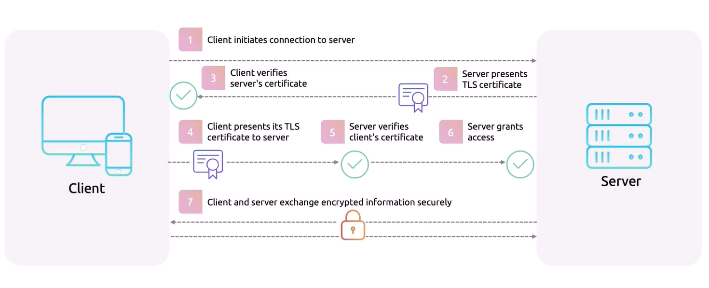

# Kubernetes Networking

## CNI
CNI provide a standardize way for container orchestrator such as k8s to integrate with various networking solutions and plugins => ensuring consistent networking. 

In k8s cluster, 
- kube-api talk to the kubelet to launch a pod
- the kubelet talk to the container runtime 
- the container runtime then create a network namespace for the pod to be launch 
- the container runtime then call the CNI which create the network configuration and virtual interfaces 
- the CNI report the configuration back to the runtime
- then the runtime launch the container in the namespace where the pod was created. 

In order to ensure standardize and flexible integration, CNI consists of configuration used to define: 
- Network configuration file format
json file which is interpreted by the runtime at execution time
- Protocol for container runtime to CNI
- Procedure for executing plugins
- Procedure for plugins to delegate fonctionality to other plugins
- Data types for plugins to return results to runtimes

### Cilium
Install the Cilium CLI (https://docs.cilium.io/en/stable/gettingstarted/k8s-install-default/) 

Install the Hubble Client, In order to access the observability data collected by Hubble (https://docs.cilium.io/en/stable/gettingstarted/hubble_setup/#install-the-hubble-client)

## Kubernetes network Model 
- Pods can communicate on the same node through the loopback interface
- Pods can communicate across nodes without the need for NAT
Achiving this involves assigning a unique IP to each pod; this a accomplish by using a CNI

### Pod to pod communication
- check cilium logs when creating a pod
- check interface created on the node: ip add | grep -A1 lxcXXXX
- ip netns exec cni-xxxxxxxxxxxx ip add --> shoul map the ip of the endpoint
- when the pod is deleted the ep is also deleted, so is the interface
- can can also use DNS for pod to pod communication: k exec -it pod -- cat /etc/resolv.conf

### Service discovery and DNS
- Kubernetes automates Service discovery with EndpointSlices
- EndpointSlices update when pods linked to a service change
- k8s offers two mechanism for svc discovery: ENV variables and DNS
- You can check the ENV inside the pod: k run -it --rm test --image=centos --restart=Never -- bash ==> export
- For DNS; cat /etc/resolv.conf

### Common scenarios that will require network troubleshooting
- CNIs: check the CNI pods (logs, events, host status)
- Network Policies: vrify the existing (misconfiguration, accidental policy deletion). Test conncetivity (ping, netcat, curl)
- Service Discovery and DNS: verify status pods in kube-system,check logs for errors. Check CoreDNS configmap in kube-system ns (reconfigured incorrectly; Deletion of DNS file ...). Test with dig, nslookup...

### Ingress Controllers
- Reads Ingress resources and manages routing accordingly
- Enables external access to applications based on ingress rules
- Pod running on the cluster

Ex: nginx-controller, Traefik ...

Traefik overview
- Simple, modular design
- Seamless integration with contenerize apps and microservices
- operate as a reverse proxy
- Automatic service discovery and configuration 
- Supports HTTP, HTTPS, TCP, UDP
- Automatic HTTPS with Let's Encrypt
- Middleware customization (addapt request/reponse)

### Installation
- Add the Traefik Helm repo: `helm repo add traefik https://traefik.github.io/charts`
- Install Traefik using helm with default values `helm install traefik traefik/traefik`
- Modify the values of the values.yaml file to utilize a NodePort service type and to use a NodePort for web and websecure ports (https://github.com/traefik/traefik-helm-chart/blob/master/traefik/values.yaml)
`helm upgrade  --values=values.yaml traefik traefik/traefik`

## Network Security
### Cert Manager and Let's Encrypt
Cert Manager 
- is a open source k8s addon design to automate the management of TLS certificate: issuing, creating and renewing certs.
- supports multiples Issuers 
- Cert Manager operates through a set of controllers --> CRDs (Certifacte, Issuer, ClusterIssuer)

Let's Encript
How it works? 
It use the ACME protocol to automate the process of issuing and renewing the SSL certificate. 
- The process begins when an admin install an ACME client, such as Cert Manager; the client initiate a request to Let's Encript by generating a key pair and sending the public key to the ACME server allong with the request for a certificate. 
- Let's Encript uses a Challenge (HTTP-01, DNS-01) to verify the domain ownership
- Once the challenge is successfully completed, the ACME server validate the domain ownership 
- Upon successfull validation, Let's Encript issues a certificate which the ACME client retrieve and install on a web server. This certificate is then used to enable HTTPS to ensure secure communication between a client and a server. 
- The ACME server can be configured to automatically renew certificates before they expire.  

cert manager and let's encrypt work together to automate SSL certificate management
- cert manager handle the entire life cycle of SSL certificates including issuance, renewal and revocation;
- let's encrypt is a CA that provide creation of actual SSL certificates 

===> 
- Configure a ClusterIssuer resource in cert manager; that define let's encrypt as CA
- Cert manager interact with let's encrypt to perform the ACME challenge, validating domains ownership
- After successful validation, let's encrypt issue the SSL certificate 
- Cert manager retrieve the certificate and store it in a kubernetes secret which can be used by applications and ingress

### Installation 
https://artifacthub.io/packages/helm/cert-manager/cert-manager?modal=install
- Add repo
```
helm repo add cert-manager https://charts.jetstack.io
```
- Create a namespace called `cert-manager` for Cert-manager

- Install Cert-manager in the newly created cert-manager namespace using Helm, including all necessary Custom Resource Definitions (CRDs).

```
helm install cert-manager cert-manager/cert-manager --namespace cert-manager --set installCRDs=true
```

- Create an initial staging Issuer resource named letsencrypt-staging in the website namespace

```
apiVersion: cert-manager.io/v1
kind: Issuer
metadata:
  name: letsencrypt-staging
  namespace: website
spec:
  acme:
    server: https://acme-staging-v02.api.letsencrypt.org/directory
    email: dev-user@gmail.com
    privateKeySecretRef:
          name: letsencrypt-staging
    solvers:
    - http01:
            ingress:
              name: website-ingress
```
- Now that we have a staging issuer, update the Ingress website-ingress to use the staging issuer for the domain companyx-website.com, and specify secret name as web-ssl.

```
apiVersion: networking.k8s.io/v1
kind: Ingress
metadata:
  name: website-ingress
  namespace: website
  annotations:
    cert-manager.io/issuer: letsencrypt-staging
spec:
  tls:
  - hosts:
    - companyx-website.com
    secretName: web-ssl
  defaultBackend:
    service:
      name: website-service-nodeport
      port:
        name: http
  rules:
  - host: companyx-website.com
    http:
      paths:
      - path: /
        pathType: Prefix
        backend:
          service:
            name: website-service-nodeport
            port:
              name: http
```
Our Ingress has now been updated with Cert-manager, and a certificate has been created as a secret. We can also check the status of our certificate by describing the Certificate custom resource.

## CNI Network Policies
## mTLS Overview
- Great tool to have in a kubernetes network to help secure communications
- Extension of TLS that required both client and server to authenticate with each other using certs. While TLS primarily focuses on authenticating the server to the client and encrypting the communication channel, mTLS goes a step further by requiring mutual authentication between the client and the server.
- On a standard TLS, only the server present a certificate to prove its identity to a client: In a typical TLS handshake, the client verifies the server's identity by checking its TLS certificate. If the certificate is valid, a secure encrypted communication channel is established. The client does not present its own certificate, so the server does not authenticate the client.
- mTLS requires the client also to present a certificate. Each party use a certificate issued by a valid CA to establish a bidirectional trust relationship. In mTLS, both the client and the server present their respective TLS certificates during the handshake. The server verifies the client's certificate, and the client verifies the server's certificate. If both certificates are valid, the secure communication channel is established.



### Benefits
- Enhanced security
- Prevention of Man-in-the-Middle and other attacks 
- Improved data integrity
- Zero Trust architecture

### Challenges and Consideration
- Performance overhead
- Higher costs
- Certificate management 
- Compatibility: not all services support mTLS
- Operational complexity


